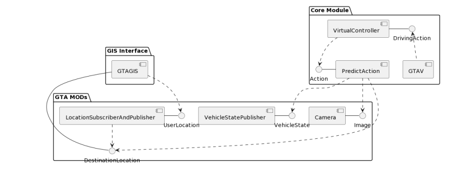
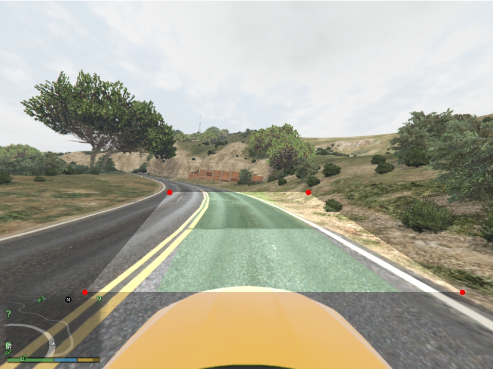

# End-to-End Autonomous Navigation via Imitation Learning

> **A vision-based autonomous agent trained on a custom 480GB dataset using a cloud-based streaming pipeline.**

*Figure 1: The Agent in Action. High-fidelity autonomous navigation handling complex intersections and dynamic traffic in Grand Theft Auto V.*

---

## 🧠 Methodology: Curriculum Learning
To manage the complexity of urban driving, I adopted a **Curriculum Learning** strategy. The agent was first trained and validated on a 'Scooter' class agent to isolate vision performance.

Once the perception layer achieved **95% lane-segmentation consistency**, I transitioned to the target vehicle class (shown above), engineering a custom **Camera Mod** to lock the viewing frustum for consistent data ingestion.

---

## 🏗 System Architecture
Unlike standard "black box" end-to-end models, this system features a decoupled architecture to handle the 60Hz game loop.

> **Note:** For the detailed Component Diagram (Figure 7), please refer to the [Defense Report PDF](assets/SDc_Final_defense_report_ORIGINAL.pdf).

*Figure 2: System Component Diagram. Data flows from the Game Engine (C++ Hook) $\to$ Python Inference Server $\to$ Virtual Controller.*

**Key Modules:**
* **Capture Layer:** `ScriptHook` extracts game state (speed, steering angle) and serializes it via **NetMQ**.
* **Inference Layer:** **EfficientNetB1** processes visual data while a secondary dense network processes the telemetry vector.
* **Control Layer:** A PID-smoothed virtual controller maps model probability distributions to DirectInput keystrokes.

---

## 📉 Data Engineering: The "Synchronization" Challenge
Collecting 480GB of high-fidelity driving data revealed critical infrastructure bottlenecks.
* **The 200GB Failure:** Initial data collection had to be discarded due to thread desynchronization between the Game Engine (60Hz) and the Python Recorder.
* **The Fix:** Implemented a **Temporal Synchronization Protocol** that locks the capture thread to the game's physics tick.
* **Cloud Training:** Engineered a custom **Streaming Data Loader** on Google Colab to train directly from GCP buckets, overcoming RAM limits by pre-fetching 100-image micro-batches.

---

## 🔬 Ablation Study: Perception Evolution
My approach evolved through three distinct phases to balance accuracy with real-time latency constraints.

### Phase 1: Edge Detection (Failed)
Initial experiments utilized Canny Edge Detection to reduce input dimensionality. However, GTA V's dynamic shadows and foliage introduced critical noise, causing the agent to lose track of the road boundary.

*Figure 3: Phase 1 Failure. Edge detection (red cross) failing to distinguish lane markers from shadow artifacts.*

### Phase 2: Geometric Transformation (The Fix)
To solve the noise issue, I implemented an **Inverse Perspective Mapping (Bird's Eye View)**. By transforming the camera frustum to a top-down orthogonal view, I could mathematically isolate the road plane and generate high-fidelity lane masks.

*Figure 4: Phase 2 Fix. Successfully isolating the lane (green overlay) using Bird's Eye Transformation.*

### Phase 3: The Latency Trade-off (Final)
While the Bird's Eye transformation was accurate, the preprocessing overhead dropped the control loop below the safe 10Hz threshold on the deployment hardware. I shifted to an **End-to-End RGB** approach using **EfficientNetB1**, which learned to extract semantic features (like road texture) implicitly without the latency penalty.

*Figure 5: Final Architecture. EfficientNetB1 processing raw RGB input with sub-10ms latency.*

---

## 📡 Engineering: Real-Time Telemetry
To debug agent behavior, I engineered a full-stack telemetry suite using **WebSockets** and **Leaflet.js**.

*Figure 6: Real-Time GIS Interface. Live tracking of agent coordinates against ground truth map data.*

---

## 🛠 Tech Stack
* **Core:** Python, TensorFlow (Keras), OpenCV
* **Simulation Interface:** C# (.NET ScriptHook), C++
* **Infrastructure:** Google Cloud Platform (GCP), NetMQ, WebSockets

---
---
---
## 👥 Credits & Team
This project was developed as a Capstone Research effort.

* **Abhijeet Pandey:** **Lead Research Engineer.**
    * Designed the End-to-End ML Architecture and Computer Vision pipeline.
    * Engineered the Cloud Infrastructure (GCP/Colab) and Custom Simulation Interface (GTA V Modding/ScriptHooks).

* **Bishal Pahari:** **Mobile & GIS Engineer.**
    * Developed the mobile telemetry application.
    * Implemented real-time GIS mapping and coordinate visualization services.

* **Saurav Bhattarai:** **Technical Research Associate.**
    * Collaborated on model architecture selection (EfficientNet) and training strategy.
    * Conducted critical feasibility research on GTA V modding tools and simulation constraints.

* **Amrit Kharel:** **Integration & Testing Support.**
    * Assisted with backend-to-frontend connection testing.
    * Conducted initial system validation and quality assurance checks.
